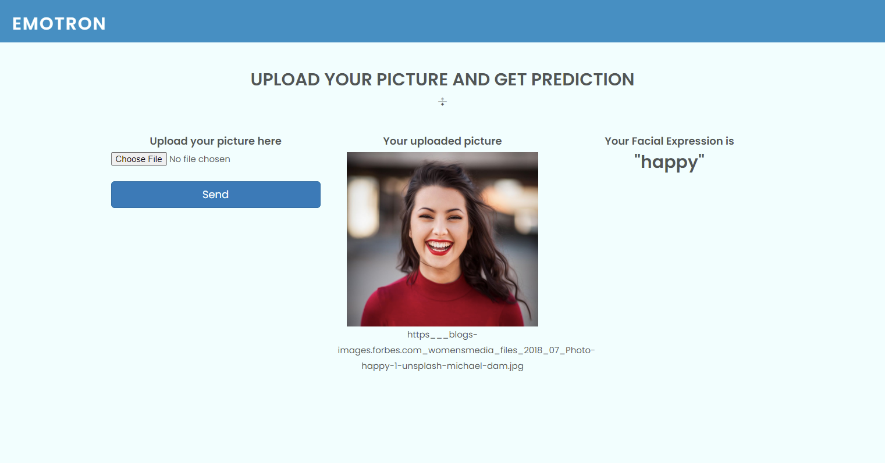

# EmotionRecognitionAPI
Nodejs Server for serving requests of Facial Expression  and Speech Emotion,An Emotion Prediction API for a game that can Analyze your Facial Expressions and Emotions from your voice.

### Speech Emotion 
A CNN is trained on RAVDNESS dataset for Speech Emotion Recogniton; Feature Extractions Through Librosa and 8 layred to classify Emotions ,
  * which can Classify 6 emotions in your voice Namely 
    1. Happy
    2. Neutral 
    3. Sad
    4. Angry
    5. Surprised
    6.Disgust
    7. Fearful

### Facial Expressions 
For Facial Expressions Also we used CNN we used a mix datat set Containing FER2013 and some animated pictures which very good Accuray for Recognizing Different
Expressions of Human Face 

### Facial Expressions 
Simple Ejs Engine is used to Compile HTML and CSS,
_and Icons are Made in Adobe Illustrator_
#

